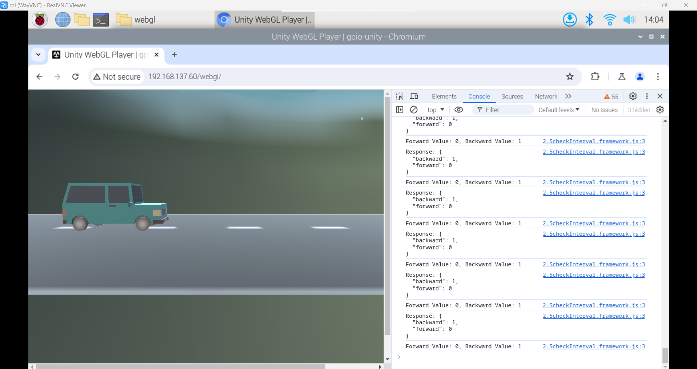

# RPi to Unity
A Raspberry Pi 4 Model B is configured to use two Hall effect sensors (HES) to send input data to a Unity game. The HES are connected via the RPi's GPIO and a Python script is used to detect magnetic fields. In the same Python script the use of Flask was employed in order for the RPi to connect to the Unity game. Two HES were used to provide forward and backwards movement for the player in the Unity game.

## Installation
Configure the two HES on the RPi's GPIO ports and in the RPi-Python-HES.py. The **left** HES, used for forward movement, is connected to RPi GPIO 17, while the **right** HES, used for backward movement, is connected to RPi GPIO 27. GPIO 3v3 and ground were used for providing power to the circuit.

### Building the Unity Game for WebGL
#### 1. Installing the WebGL Build Support Module
Before creating your Unity environment, make sure to install the WebGL build support for Unity in order to access the WebGL build tools in your Unity version. You can access this through the “Add Modules” tab located in the version settings in Unity Hub. After which you can launch your Unity project which will open the editor.

#### 2. Placing the scripts in the editor
* Place the [PlayerController.cs](./1_UnityScripts/PlayerController.cs) in the editor and be sure to specify the object that will be controlled by the HES.
* Edit the PlayerController.cs and go to line 41 and change ip address to that of the Raspberry Pi's. Save and exit. It should look something like this:

        http://192.168.0.105:5000/gpio
* **OPTIONAL:** Place the [FollowCar.cs](./1_UnityScripts/FollowCar.cs) in the editor and be sure to specify the object that the camera will follow.

#### 3. Building the WebGL Application
Under Publishing Settings in the Player Settings, change the Compression Format to DISABLED. This is because most web server libraries have a hard time unpacking compressed files which results in the environment not working entirely. Thus, building the environment uncompressed helps with compatibility in whatever web server you are using. Once done, you may build the WebGL application. A directory containing all the files needed will be created.

### Setting Up Apache2 for WebGL
#### 1. Installing Apache2 via the terminal

    sudo apt update -y
    sudo apt install apache2 -y
#### 2. Check if Apache2 is running via the terminal.

    sudo systemctl restart apache2
    systemctl status apache2
#### 3. Verify Apache2 using the Chromium/Firefox browser.
Finally, you can simply open a web browser and navigate to http://localhost. If Apache is running, you should see the default Apache welcome page or any content you have hosted.

### Hosting the WebGL Application
#### 1. Create a directory for the WebGL application:
The command **mkdir** (make directory) creates a folder (directory). For this example, I named the folder "webgl" but you can set that with your own desired folder name.\

    sudo mkdir /var/www/html/webgl
    
#### 2. Configuring the directory for Apache2
* Edit the configuration file using the following command on the terminal.

        sudo nano /etc/apache2/apache2.conf
* Add the following lines to add our directory to enable it in Apache2. You will need to replace "webgl" if you used a different name for the directory.

        <Directory /var/www/html/webgl>
	        Header set Access-Control-Allow-Origin "*"
	        Header set Access-Control-Allow-Methods "GET, POST, OPTIONS"
	        Header set Access-Control-Allow-Headers "Content-Type, Authorization"
	        Options Indexes FollowSymLinks
	        AllowOverride All
	        Require all granted
        </Directory>

        AddType application/octet-stream .wasm
        AddType application/javascript .js
* Save the file using ctrl+x and pressing enter.

#### 3. Copy your WebGL build files to the Apache2 WebGL directory.
* Ensure your build files are placed in a folder similarly named to your WebGL directory name. For my case it's "webgl."
* Using the following command, we will be copying the webgl folder containing the build files to the Apache2 WebGL directory.

        sudo cp -r /path/to/build/files/webgl /var/www/html/webgl
* Restart the Apache2 process by executing the following command on the terminal.

        sudo systemctl restart apache2

### Running WebGL-Unity-RPi
#### 1. Copy the [gpioFLASKCORS.py](./2_PythonFlaskGPIO/gpioFLASKCORS.py) to a directory on your RPi.
#### 2. Run the Python script using the following command on the terminal.

    cd /path/to/your/script/directory/
    python gpioFLASKCORS.py
#### 3. Open Chromium or Firefox on the RPi and enter the link to the WebGL application we created previously.
Replace the ip address to your RPi's ip address. Replace webgl to the directory name you created if it isnt name webgl.

    https://192.168.0.105/webgl

#### 4. Congratulations! It should be running now.

## Scripts
1. [FollowCar.cs](./1_UnityScripts/FollowCar.cs) - The Unity C# script used for making the camera follow the object being controlled.
2. [PlayerController.cs](./1_UnityScripts/PlayerController.cs) - The Unity C# script used for controlling the object which works by reading the .json file created by the Python script.
3. [gpioFLASKCORS.py](./2_PythonFlaskGPIO/gpioFLASKCORS.py) - The Python script that hosts the Flask server which stores the inputs using a .json file
4. [apache2.conf](./3_ApacheConfigs/apache2.conf) - My config file that I used for my Apache2 setup for your reference.

## Credits
The [DLSU IBEHT SIGLA](https://www.dlsu.edu.ph/research/research-centers/ibeht/neurotech/) Prototyping Team

## Languages and Tools:</h3>

    
